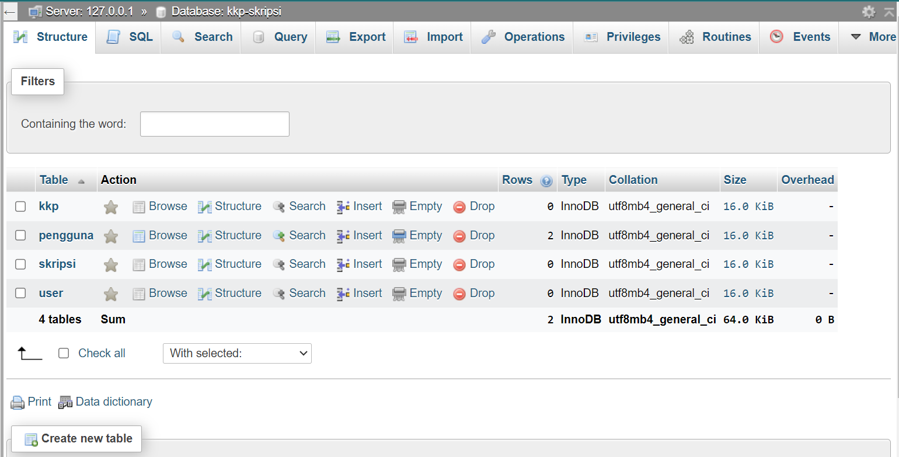
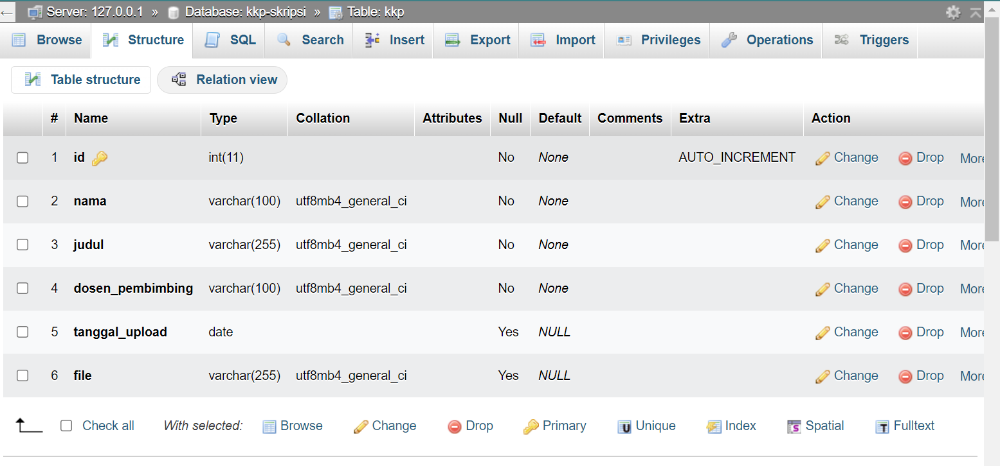
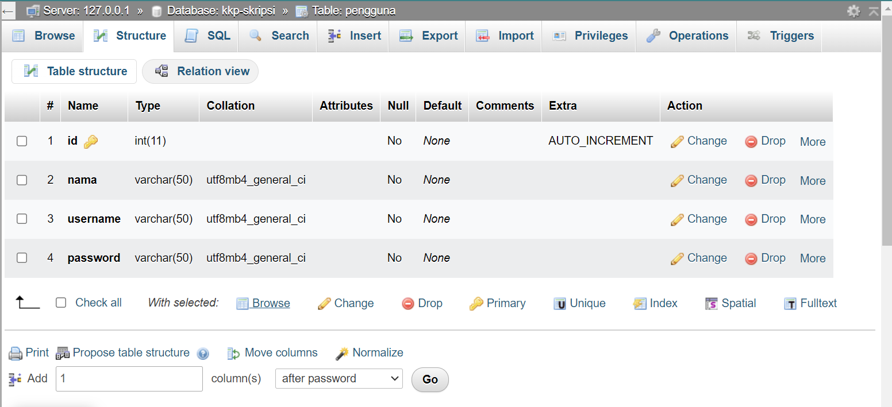
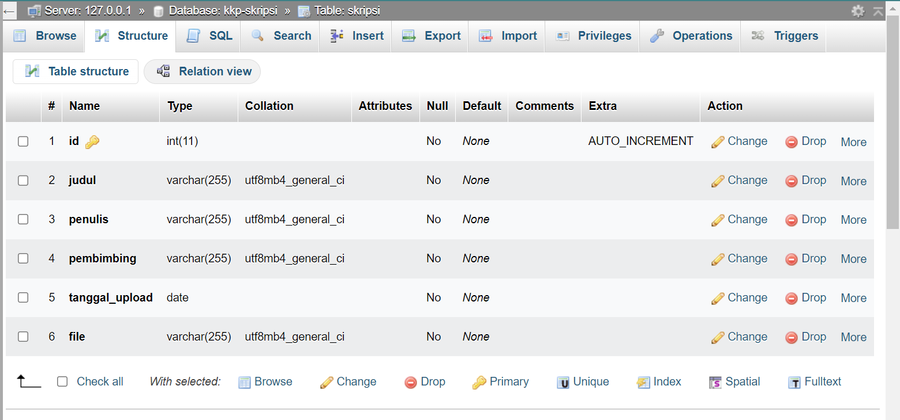
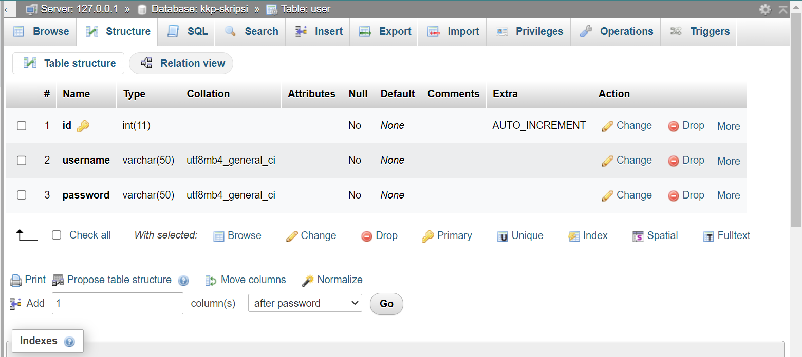
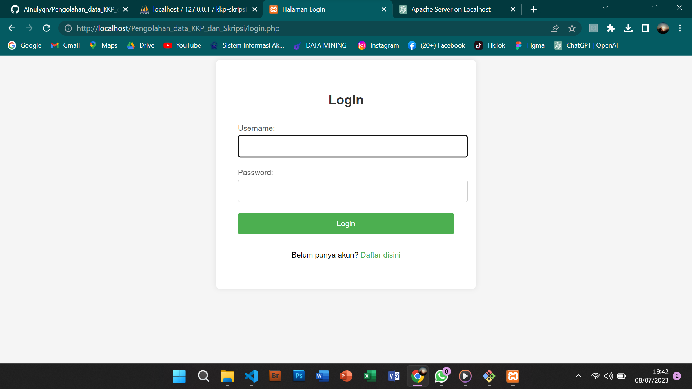
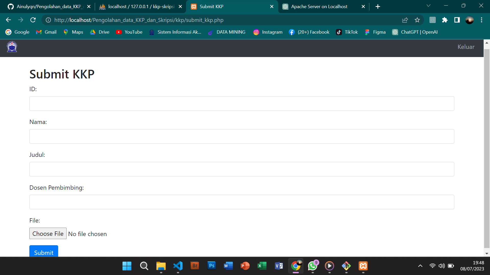
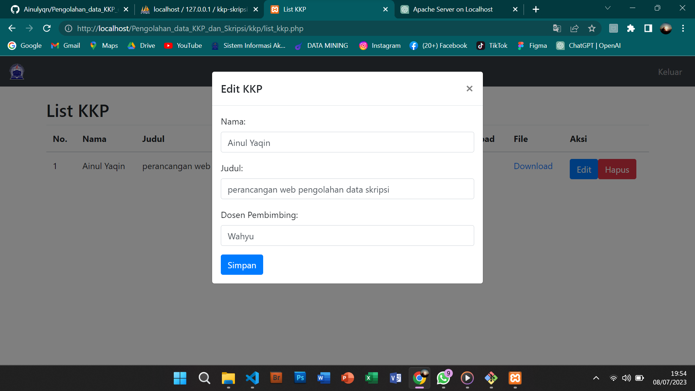
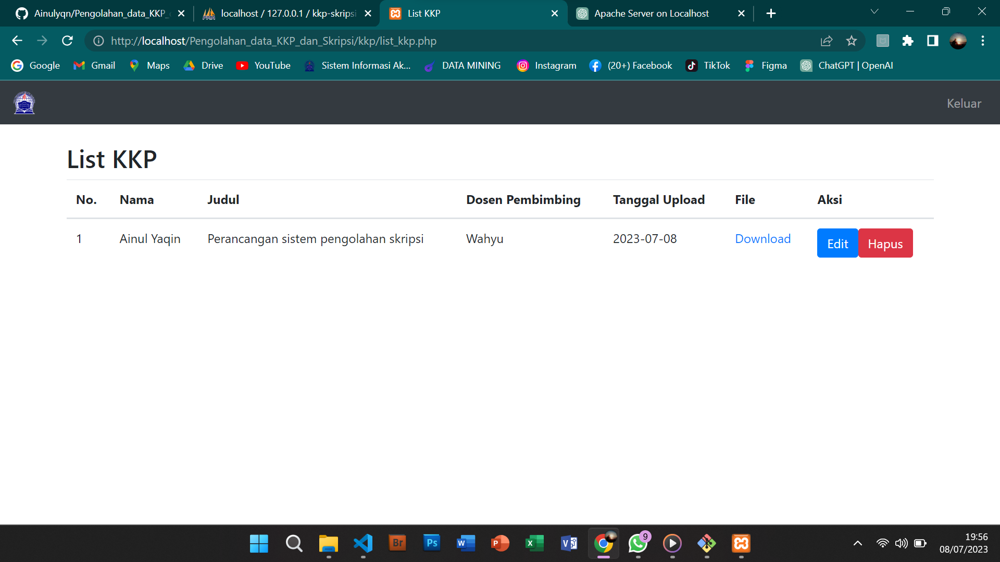

# Pengolahan_data_KKP_dan_Skripsi

## Kelompok 10 - TI.21.A.1

| NIM             | Nama                         |
| --------------- | ---------------------------- |
| **312010423**   | AINUL YAQIN                  |
| **312010443**   | MUHAMMAD BISMA PUTRA HARYANA |
| **312110594**   |                              |

## Rancangan Database
Berikut perancangan database yang kami buat dalam aplikasi "Pengolahaan Data KKP dan Skripsi"  
  
  
   
  
  
 
# Tampilan Aplikasi  
### Tampilan login  
  
### Tampilan setelah login  
  
Aplikasi "Pengolahan Data KKP dan Skripsi" adalah sebuah aplikasi yang dirancang untuk memudahkan mahasiswa dalam proses pengolah dan pengumpulan, pengeditan, penghapusan, melihat detail, dan penyimpanan laporan KKP (Kerja Kepentingan Perkuliahan) dan skripsi. Aplikasi ini bertujuan untuk menyederhanakan dan mengotomatisasi beberapa aspek penting dalam proses akademik ini, sehingga memungkinkan mahasiswa untuk lebih fokus pada penelitian mereka. 

##Fitur utama dalam aplikasi ini meliputi:  

## 1. Pengumpulan Laporan: 
 
Aplikasi ini memungkinkan mahasiswa untuk mengunggah laporan KKP atau skripsi mereka dengan mudah. Mahasiswa dapat memilih file laporan dari perangkat mereka dan mengirimkannya langsung melalui aplikasi. Sistem yang terintegrasi akan secara otomatis menyimpan laporan ke dalam basis data yang aman. 

## 2. Mengedit Laporan: 
 
Aplikasi ini menyediakan fungsi pengeditan laporan yang memungkinkan mahasiswa untuk melakukan perubahan atau penyesuaian pada laporan yang sudah diunggah sebelumnya. Mahasiswa dapat menambahkan atau menghapus konten, mengubah format, atau melakukan penyuntingan lainnya pada laporan mereka. Perubahan tersebut akan diterapkan secara real-time dan laporan yang terbaru akan tersimpan. 

## 3. Menghapus Laporan: 
 
Fitur ini memungkinkan mahasiswa untuk menghapus laporan yang sudah diunggah jika diperlukan. Mahasiswa dapat memilih laporan yang ingin dihapus dan mengonfirmasi tindakan tersebut. Setelah laporan dihapus, data laporan tersebut akan dihapus dari basis data aplikasi. 

## 4. Melihat Detail Laporan: 
 
Aplikasi ini menyediakan tampilan rinci untuk setiap laporan yang diunggah. Mahasiswa dapat melihat informasi terkait laporan seperti judul, penulis, tanggal unggah, dan status pengumpulan. Selain itu, mahasiswa juga dapat melihat isi laporan secara lengkap dan mengakses lampiran yang terkait. 

## 5. Menyimpan Laporan: 
 
Aplikasi ini memungkinkan mahasiswa untuk menyimpan laporan KKP atau skripsi mereka secara aman. Setelah laporan diunggah, aplikasi akan menyimpannya dalam basis data yang terlindungi. Hal ini memastikan bahwa laporan tersebut tidak hilang dan dapat diakses kembali oleh mahasiswa jika diperlukan. 

Selain fitur-fitur utama di atas, aplikasi ini juga dapat menyediakan fitur tambahan seperti notifikasi untuk pengingat tenggat waktu pengumpulan, integrasi dengan sistem akademik kampus untuk memudahkan verifikasi, dan kemampuan berbagi laporan dengan dosen pembimbing secara langsung. 

Dengan adanya aplikasi "Pengumpulan Data KKP dan Skripsi", diharapkan mahasiswa dapat mengelola laporan mereka dengan lebih efisien dan terorganisir. Aplikasi ini membantu mengurangi kekhawatiran tentang kehilangan atau kerusakan laporan, sehingga memungkinkan mahasiswa untuk lebih fokus pada penelitian dan pekerjaan akademik mereka. 

## Link Youtube 

Berikut link youtube kelompok kami :  

## Link Web Hosting (Demo Program) 

Berikut link web hosting kelompok kami :  

## Terima Kasih!
